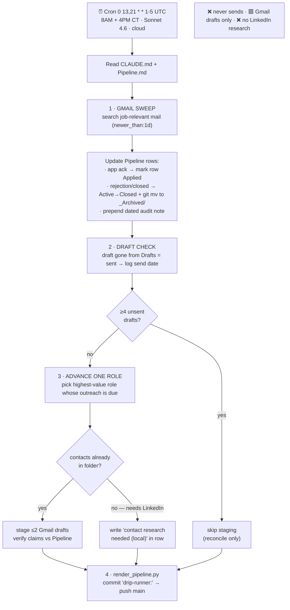
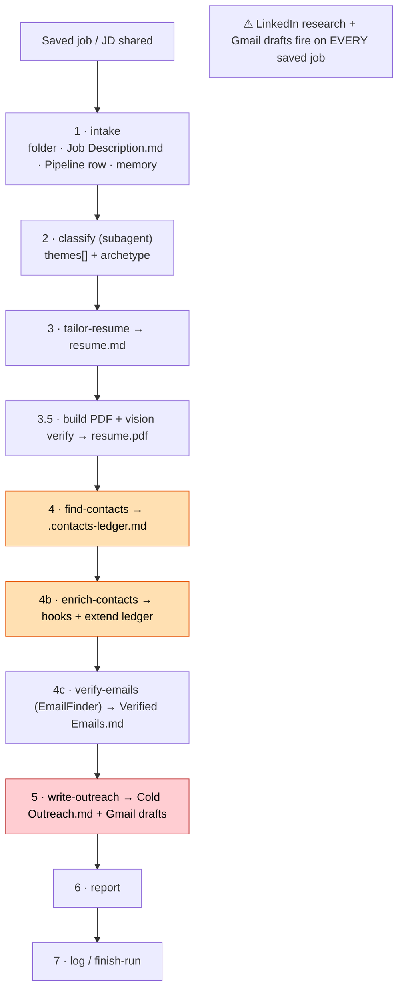
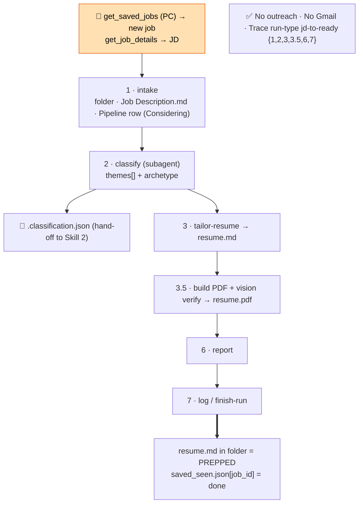
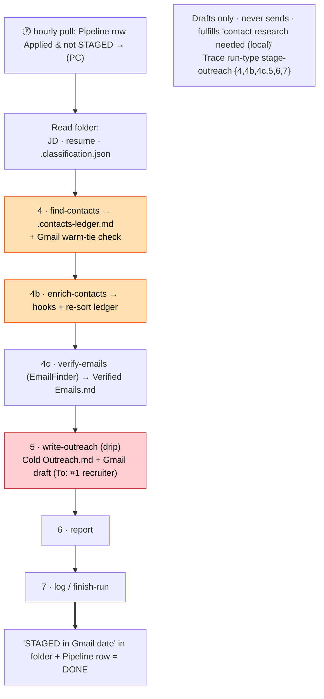
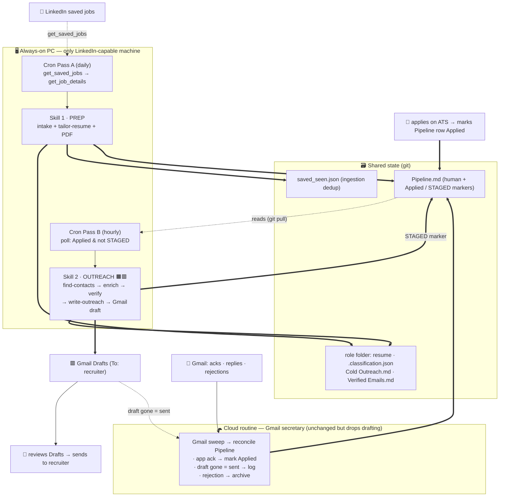

# Automation Architecture — Diagrams

_Drafted 2026-06-26, revised to the simple approach. Visual companion to `Automation Architecture - Two-Orchestrator Split.md` and the two `Spec - Orchestrator …` files. Mermaid renders inline in Obsidian._

Legend: 🟧 LinkedIn (daemon-bound, PC only) · 🟥 Gmail (drafts only) · `==>` writes/state · `-.->` reads/trigger.

**The simple model in one line:** both skills run on the PC (because every entry point touches the LinkedIn MCP); the cloud routine stays a pure Gmail secretary; the "apply" trigger is an hourly poll of `Pipeline.md`. **No `role_state.json`** — state is read from files that already exist.

---

## 1 · Current cloud routine ("Application Drip-Runner, 2×/weekday")

What runs today in the cloud (`trig_01Dhy19jRLQM6sggLQ4249rm`): a Gmail-driven Pipeline reconciler + secretary. It already detects "applied" (from Gmail acks) and stages drafts from contacts already in the folder, but cannot do LinkedIn research.

> In the simple target (diagram 5) this routine **keeps steps 1, 2, 4** and **drops step 3's drafting** — all drafting moves to the PC's outreach skill, which has the contacts because it just scraped them.

---

## 2 · Current `jd-to-ready` (monolithic orchestrator)

The skill as it exists now: one linear run, **all 7 steps on every saved job** — LinkedIn research and Gmail drafts for roles you may never apply to.

---

## 3 · Skill 1 — `jd-to-ready` (prep), save-side

Fires when you save a job on LinkedIn. Runs on the **PC** (its trigger `get_saved_jobs` and JD fetch `get_job_details` are LinkedIn-MCP). Cheap local work, no flag risk, stops at the apply gate. Adds the `.classification.json` hand-off.

---

## 4 · Skill 2 — `stage-outreach`, apply-side

Fires when the hourly poll finds a role marked **Applied** with no `STAGED` marker. Runs on the **PC** (LinkedIn). Does the whole research→verify→draft chain on one machine and drops a Gmail draft addressed to the #1 recruiter.

---

## 5 · Suggested simple architecture

Both skills on the PC (the only LinkedIn-capable machine — and every entry point, including *detecting a save*, is a LinkedIn-MCP call). The cloud routine stays the Gmail secretary. The apply trigger is an hourly `Pipeline.md` poll. State lives in files that already exist — **no `role_state.json`, no separate apply-detector.**

### Who owns what

| Actor | Runs where | Owns |
|---|---|---|
| Cron Pass A → Skill 1 (prep) | **PC** | resume + PDF on save; mark `saved_seen` done |
| Cron Pass B → Skill 2 (outreach) | **PC** | find recruiter → verify email → Gmail draft → `STAGED` marker |
| Cloud routine | **cloud** | Gmail→Pipeline reconcile, send-detection, rejection archival |
| You | — | apply (mark row Applied) · review + send the draft |

### State = file markers (no ledger)

| State | How it's read |
|---|---|
| `prepped` | role folder has a tailored resume `.md` |
| `applied` | Pipeline row marked **Applied** (by you, or the cloud routine from an app-ack) |
| `staged` | `STAGED in Gmail <date>` in the folder + Pipeline row |

### One decision baked in

The cloud routine's **step-3 drafting** overlaps Skill 2 — both could draft for applied roles. This diagram **retires cloud step-3 drafting** so there's exactly one drafter (the PC, which has the contacts). The `STAGED` marker is the safety net during any overlap. (Alternative: keep cloud step 3 as a folder-contacts-only fallback.)
